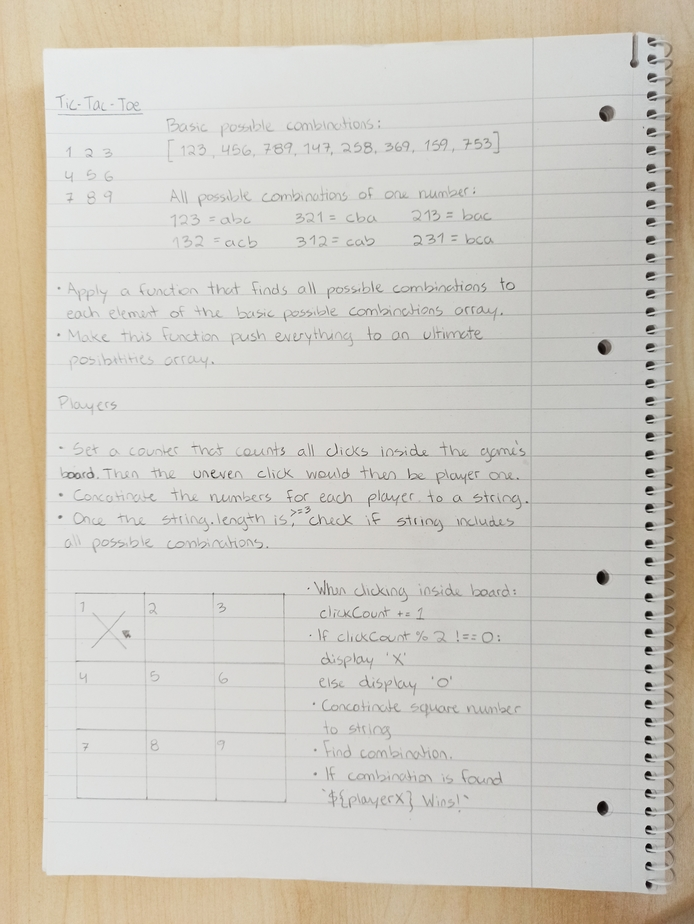

# Project log

## Overview

The classic Tic Tac Toe game.

## Details

- This proyect is intended to practice and adquire new skills regarding programming. It is made just as an exercise, but feel free to play and give my code feedback whenever you want.

- The intended user is anyone who wants to play, or anyone who finds the code iteresting or useful.

- The required content is a grid element where the board can be displayed. Since I planed this already, it would not have a great impact on my timeline.

- The step by step process is provided in the wireframe section.

## Wireframes

## Time

- Estimated: 8 hours over the weekend.
- Actual:

## New skills

(what did you research for this project?)

## Challenges + lessons learned

(What didn't go well? How would you advise future-you so it goes better next time?)

## Achievements

(What did you do this time that was an improvement on last time? Acknowledge your progress, you've earned it!)

